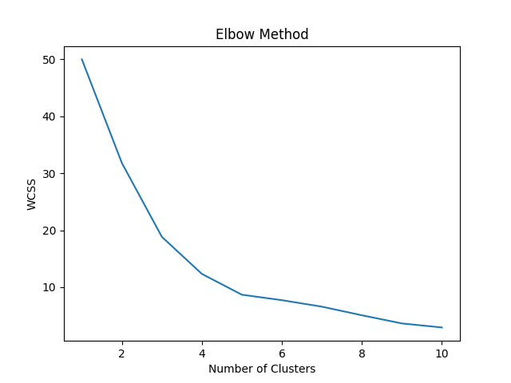
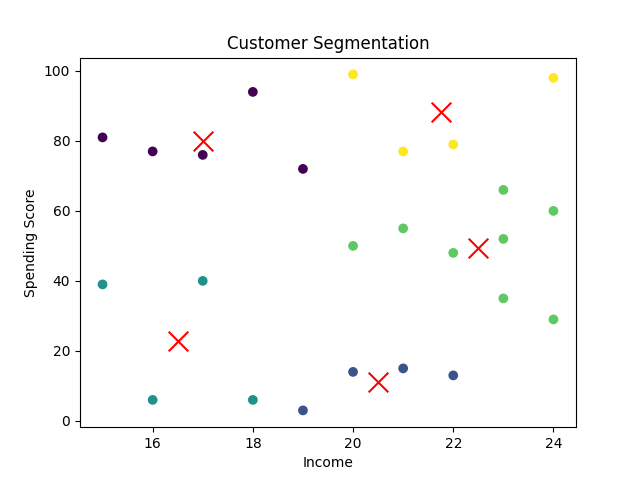

# Customer Segmentation using K-Means (Machine Learning)

## 📌 Project Overview

This project performs **customer segmentation** using the K-Means clustering algorithm. It groups customers based on their **annual income** and **spending score** to help businesses understand customer behavior and target them effectively.

---

## 🚀 Features

- K-Means clustering implementation
- Elbow method to find optimal number of clusters
- Feature scaling using StandardScaler
- Data visualization with cluster centroids
- Customer segmentation analysis
- Prediction system for new customer input

---

## 🧠 Concepts Used

- Unsupervised Learning
- K-Means Clustering
- Feature Scaling
- Elbow Method
- Data Visualization
- Business Interpretation of Data

---

## 📂 Project Structure

```
customer-segmentation-ml/
│
├── data/
│   ├── customers.csv        # Input data
│   └── output.csv           # Clustered output
│
├── model/
│   ├── model.pkl            # Saved KMeans model
│   └── scaler.pkl           # Saved scaler
│
├── src/
│   ├── main.py              # Training and clustering
│   └── predict.py           # Predict cluster for new input
│
├── requirements.txt
└── README.md
```

---

## 📊 How It Works

1. Load customer dataset
2. Scale features for fair comparison
3. Apply K-Means clustering
4. Find optimal clusters using Elbow method
5. Visualize clusters and centroids
6. Save trained model
7. Predict cluster for new customer input

---

## 🎯 Customer Segments Identified

- 💎 Premium Customers (High income, high spending)
- 💰 Saver Customers (High income, low spending)
- 📉 Budget Customers (Low income, low spending)
- 🛒 Impulsive Buyers (Low income, high spending)
- ⚖️ Average Customers (Medium income, medium spending)

---

## 🧪 Example Prediction

Input:
Income = 20
Spending Score = 50

Output:
Medium Income, Medium Spending Customer

---

## ⚠️ Important Notes

- Model works best within the dataset range
- Clustering does not guarantee exact classification
- Results are based on similarity (distance)

---

## 🛠️ Tech Stack

- Python
- Pandas
- NumPy
- Matplotlib
- Scikit-learn

---

## ▶️ How to Run the Project

### 1️⃣ Clone the repository

```bash
cd customer-segmentation-ml
git clone https://github.com/finiaks/Customer-Segmentation-ML.git

```

---

### 2️⃣ Install dependencies

```bash
pip install -r requirements.txt
```

---

### 3️⃣ Run the main program (training + clustering)

```bash
cd src
python main.py
```

---

### 4️⃣ Run prediction for new customer

```bash
python predict_cust.py
```

---

### 5️⃣ Enter input when prompted

Example:

```
Enter the Income of Customer: 20
Enter the Spending Score of Customer: 50
```

---

### ✅ Output

```
Medium Income , Medium Spending Customer.
```

---

## 📸 Output Screenshots




---

## 📈 Future Improvements

- Add more features (Age, Gender)
- Improve dataset size
- Build web app using Streamlit
- Deploy model online

---

## 💡 Conclusion

This project demonstrates how machine learning can be used to group customers and generate valuable business insights.

---

## 👨‍💻 Author

Akshay Prakash
